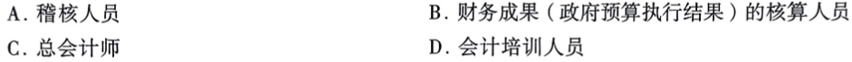
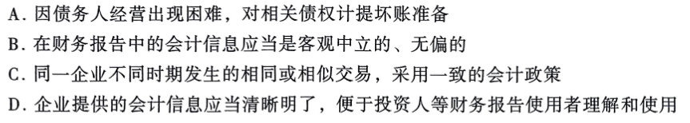

## 选择题

=== "1"
	``` markdown
	下列各项中不属于会计人员的是( )。
	```
	<div class="result" markdown>
	
	
	??? answer
		
		!!! question "什么是{==会计人员==}？"
			
			==Answer==: (1)
			{ .annotate}
			
			1.  会计人员通常是指从事会计核算、财务管理和监督等工作的专业人员。他们的主要职责包括记录经济业务、编制财务报表、进行财务分析等。
		
		!!! question "什么是{==稽核人员==}？"
			
			==Answer==: (1)
			{ .annotate}
			
			1.  稽核人员是负责对会计账目、财务报表等进行审核和检查的专业人员，确保财务数据的真实性和准确性。他们属于会计监督体系的一部分，因此属于会计人员。
	
		!!! question "什么是{==财务成果（政府预算执行结果）的核算人员==}"
			
			==Answer==: (1)
			{ .annotate}
			
			1.  这类人员专门负责核算和分析政府预算的执行情况，属于财务管理和会计核算的重要组成部分。因此，他们也属于会计人员。
		
		!!! question "什么是{==总会计师==}"
			
			==Answer==: (1)
			{ .annotate}
			
			1.  总会计师是企业或单位中负责全面管理会计工作的高级管理人员，他们不仅需要掌握会计知识，还要具备财务管理、内部控制等方面的能力。因此，总会计师属于会计人员。
	
		!!! question "什么是{==会计培训人员==}"
			
			==Answer==: (1)
			{ .annotate}
			
			1.  会计培训人员的主要工作是教授会计知识和技能，帮助他人学习和掌握会计相关的内容。虽然他们与会计领域密切相关，但他们的主要职责是教学和培训，而不是直接从事会计核算和管理工作。因此，会计培训人员不属于会计人员。
		
	</div>

=== "2"
	```markdown
	下列各项表述中，体现可靠性会计信息质量要求的是( )。
	```
	
	<div class="result" markdown>
	??? "Answer"
	
		
		
	    !!! question "因债务人经营出现困难，对相关债权计提坏账准备"
	
	        ==Answer==: (1)
	        { .annotate}
	
	        1.  这个选项描述的是谨慎性原则的应用，即在面对不确定性时，企业应合理估计可能发生的损失和费用。这与可靠性原则直接关联不大。
	
	    !!! question "在财务报告中的会计信息应当是客观中立的、无偏的"
	
	        ==Answer==: (1)
	        { .annotate}
	
	        1.  可靠性原则强调会计信息的真实性和准确性，要求信息必须基于实际发生的交易或事项，并且能够被验证。客观中立、无偏的信息正是可靠性的核心要求之一。
	
	    !!! question "同一企业不同时期发生的相同或相似交易，采用一致的会计政策"
	
	        ==Answer==: (1)
	        { .annotate}
	
	        1.  这个选项体现了可比性原则，确保不同期间的财务数据具有可比性，而不是直接体现可靠性。
	
	    !!! question "企业提供的会计信息应当清晰明了，便于投资人等财务报告使用者理解和使用"
	
	        ==Answer==: (1)
	        { .annotate}
	
	        1.  这个选项描述的是可理解性原则，要求会计信息易于理解，方便使用者做出决策，与可靠性没有直接关系。
	</div>


​	
