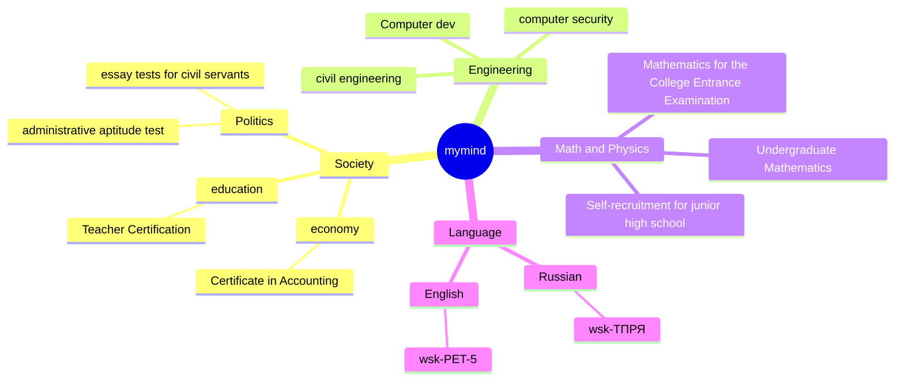
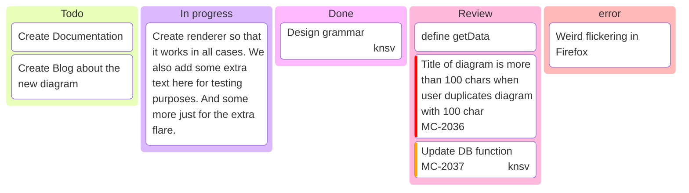

# Welcome

## 1. 简介

## 2. 个人规划目标

### 2.1 学习目标

!!! note "按照招聘需求，准备面试，通过面试拿到offer。"

    - 学习思科，华为，甲骨文，红帽，CISSP，AWS，Azure，新华三，PMP等认证
    - 深入理解网络技术基础原理，具备网络方案设计能力，能够独立完成网络设备的配置与管理
    - 掌握windows，linux服务器操作系统，具备网络设备配置与管理能力，和常见windows加固方式，和常用的linux命令
    - 熟悉数据库Oracle，SQL Server，MySQL等数据库的安装、配置与管理
    - 熟悉国内外网络安全产品，防火墙，WAF，IDS，漏扫，审计等产品的配置与管理
    - 文档撰写能力，熟练使用markdown语法编写文档
    - 熟练掌握项目管理，熟练使用项目管理工具，如JIRA、禅道等
    - Python，js，C++等编程语言基础，能够编写简单的自动化脚本
    - 能够利用cursor，设计项目架构，能够独立完成项目开发
    - git的使用，熟练使用git进行版本控制

## 3. 本周学习内容

--8<-- "docs/blog/weekily/toweek.md"