# 学习方法

## 信息加工模型

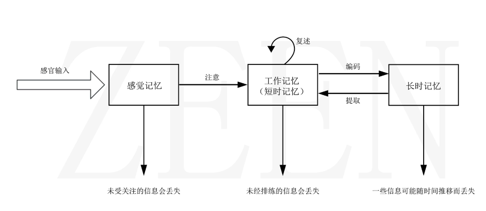v

### 什么是注意？

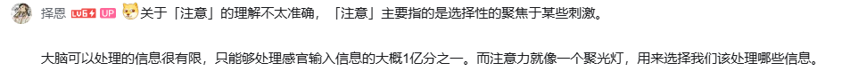

### 什么是编码？

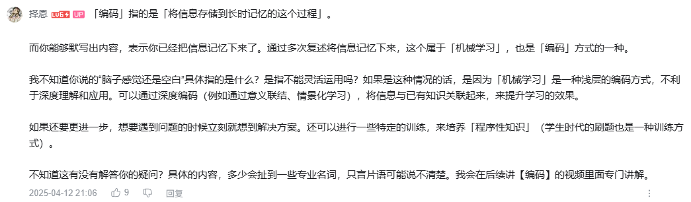

### 什么是程序性知识？

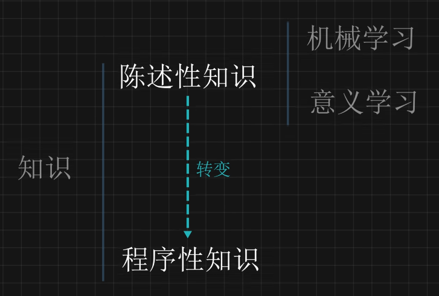

例子：解方程

> 因式分解，移项，约分。。。没有多少意识参与，自动化

#### 陈述性到程序性的转变

比如看到一道数学题是否立马有思路？

是：程序性知识

否：陈述性知识

将陈述性知识针对联系，即可转变为程序性知识

### 什么是提取？

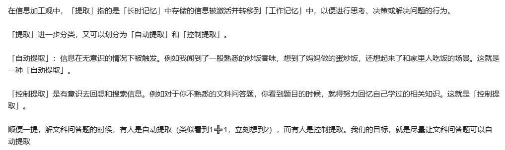

[这才是学习的底层原理！_哔哩哔哩_bilibili](https://www.bilibili.com/video/BV1h9dVYzExp)

## 常见提升学习能力思路

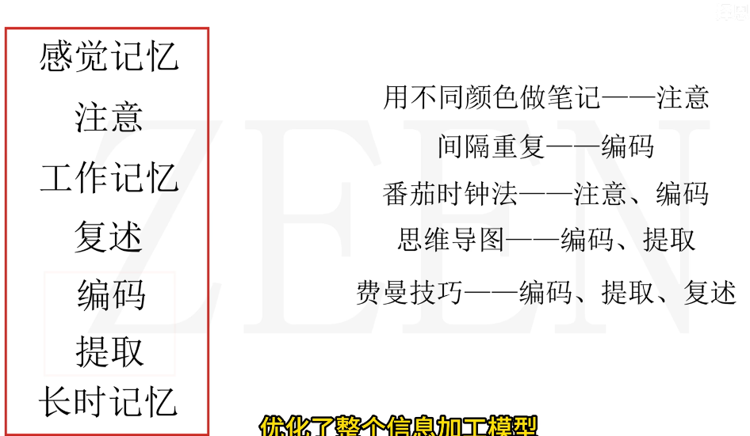

## 实践方案

### 概念理解

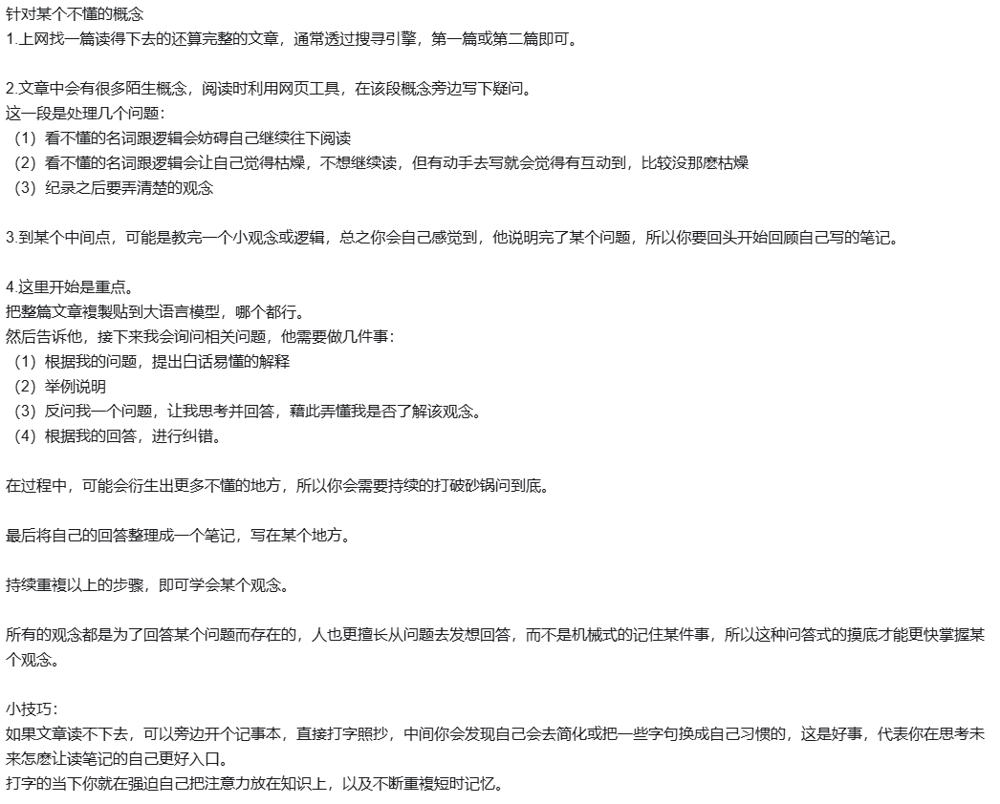

### 复习方法

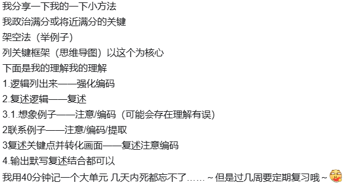

### 深度理解知识点

#### 方法步骤

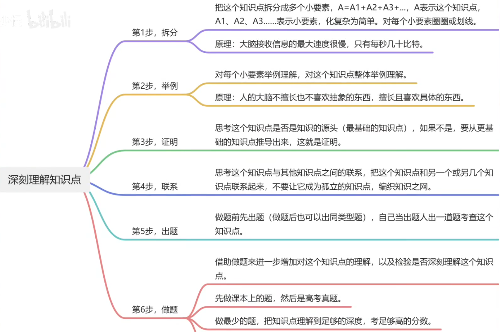

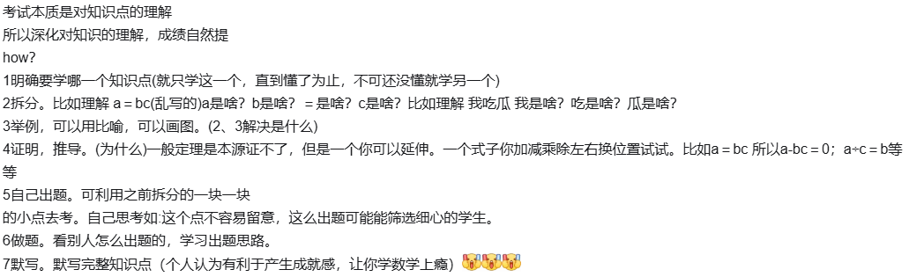

2，在进行感官输入
3，将感官输入的内容，注意，与现实，或与其他知识进行拟合，分清相同点与不同点
4，编码，利用基本逻辑，深刻理解知识内部的联系
5，提取，即在询问自己，这个知识可以拿来解释哪些问题
6，编码，提取，复习知识点，学习他人出题思路
7，提取，利用费曼学习法

#### 参考目录

[如何深度理解一个知识点？_哔哩哔哩_bilibili](https://www.bilibili.com/video/BV1Dp42117DB)

### 掌握一道题的流程

#### 目的：建立个人SOP

==为什么不会？==

知识点理解水平/学习程度：10' -> 30'

==具体SOP==

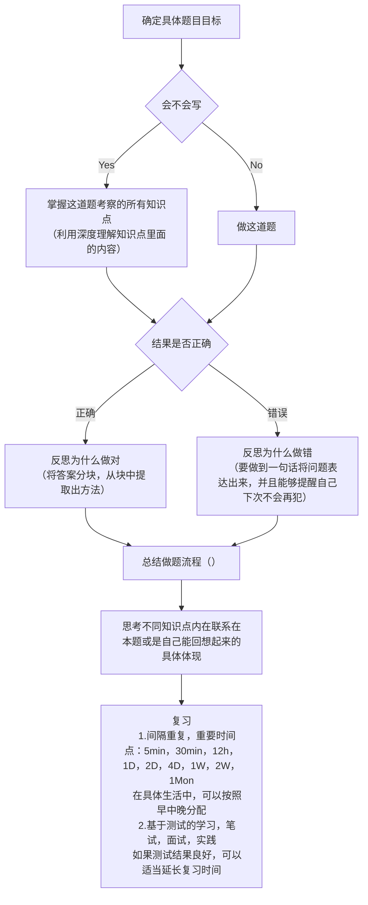

#### 总结

掌握一道题就是一次清晰可见，证据确凿的进步。
不要妄想自己可以通过自我控制，达到欺骗自己的喜欢。
需要构建的不是喜欢自己讨厌的东西，而是去营造氛围，搭建框架，填充内容，来实现一个正反馈系统，保持自己在不断进步，不断前进的学习体系。
最终实现让自己热爱，沉迷于进步的正反馈。

#### 参考目录

[掌握一道题的学习流程_哔哩哔哩_bilibili](https://www.bilibili.com/video/BV1Qy421B7F4)

### 如何掌握一本书

#### 模型

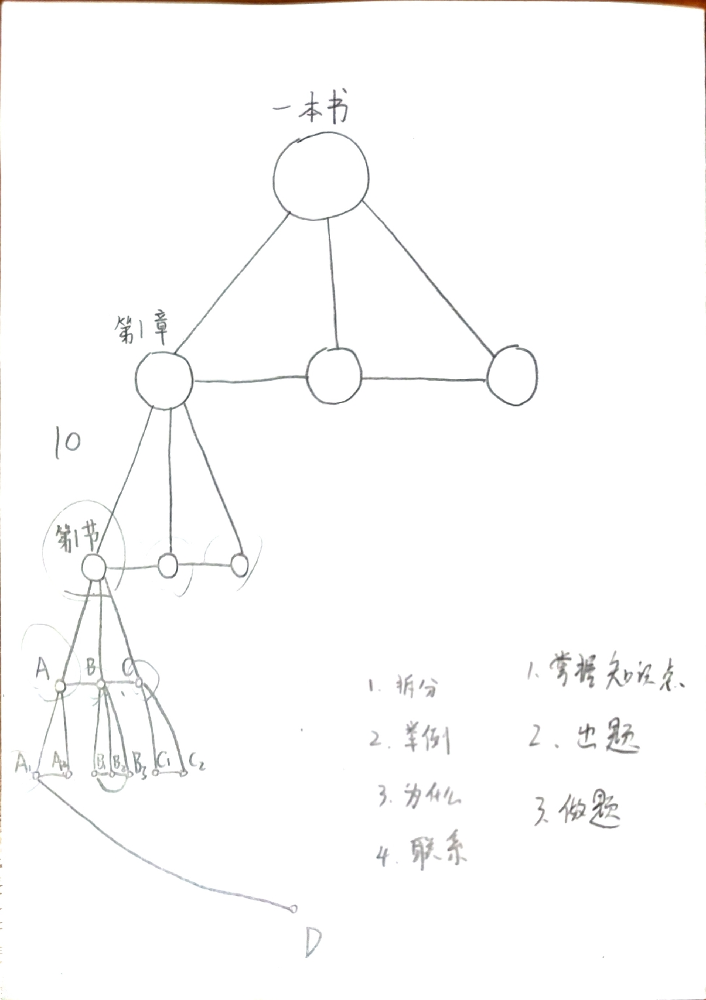

#### 参考

[快速掌握一本书的方法_哔哩哔哩_bilibili](https://www.bilibili.com/video/BV1SM4m1d7i2/?spm_id_from=333.788.recommend_more_video.1&vd_source=7ce2792e04384b010862fabd1572280b)

### 有效学习本的制作

#### 贴在封面内页

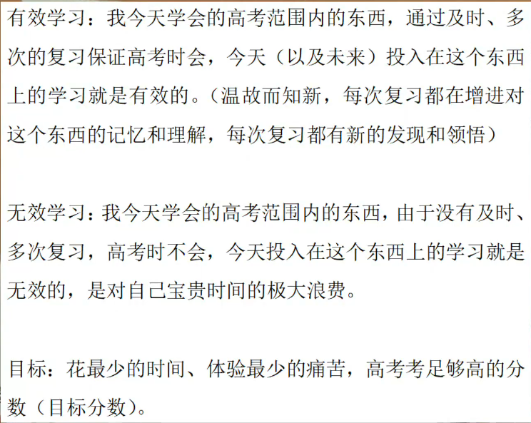

#### 内容制作

##### 正面

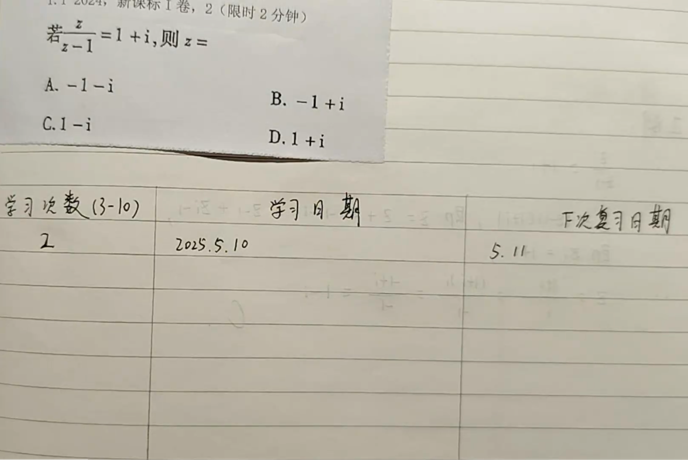

##### 反面

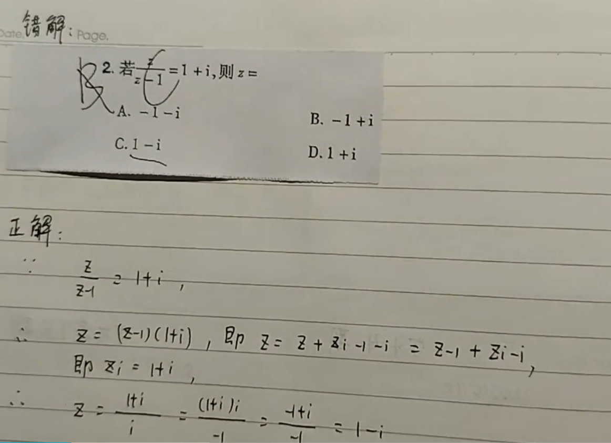

> 正解尽可能详细，不要跳步

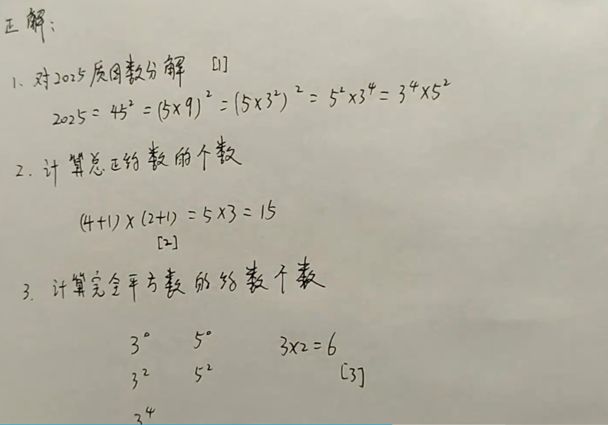

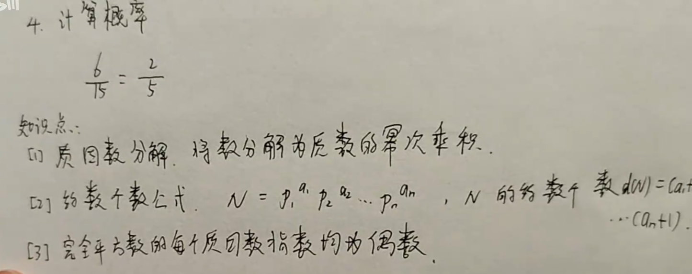

> 将知识点罗列，如果能标注出处，则标注

##### 难题解决办法

大脑有专注模式和发散模式

专注模式：即为攻关时候的状态

发散模式：睡觉散步休息时候的状态

专注模式下难以解决的问题，应该转移到发散模式，然后再进入专注模式解决。来回切换可以帮助解决复杂问题。

针对上述信息，应该对难题构建一套方案，即多次轮询式攻克。不要情绪化。现实中个人对事物的感觉，10%取决于客观情况，90%是对其的感受。应当以最适合解决问题的方式，来解决问题。

#### 参考

[制作自己的有效学习本！_哔哩哔哩_bilibili](https://www.bilibili.com/video/BV1FBEazpEhw/?spm_id_from=333.1387.homepage.video_card.click&vd_source=7ce2792e04384b010862fabd1572280b)

### 如何快速提高成绩

#### 做高于当前水平i+1的题目

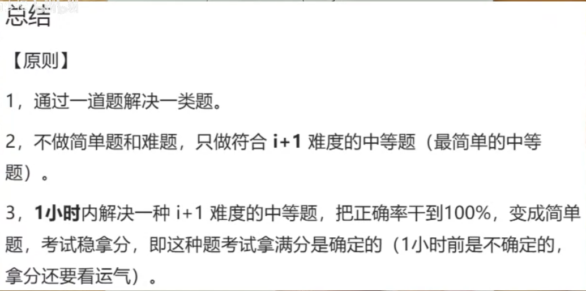

#### 参考

[怎样快速提高考试分数同时学习又比较爽（以初中物理为例）_哔哩哔哩_bilibili](https://www.bilibili.com/video/BV1W4Giz9E14/?spm_id_from=333.1387.upload.video_card.click&vd_source=7ce2792e04384b010862fabd1572280b)

### 快速入门一个学科

#### Hour One

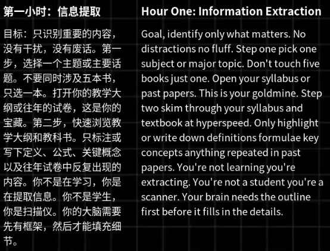

#### Hour Two

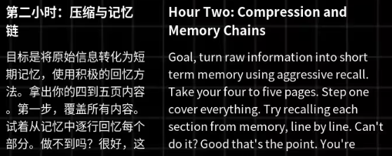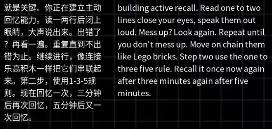

#### Hour Three

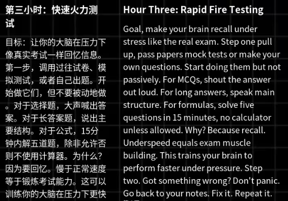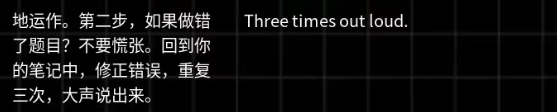

#### Hour Four

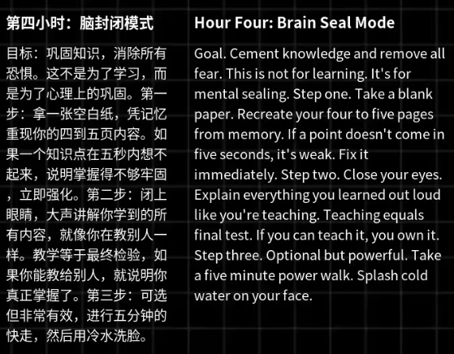

#### 参考

[【中英+文稿】如何在4小时吸收4个月的知识 | 考试前别错过这套方法_哔哩哔哩_bilibili](https://www.bilibili.com/video/BV174NDzvEiM/?spm_id_from=333.788.recommend_more_video.14&vd_source=7ce2792e04384b010862fabd1572280b)

### 回忆学习法:如何在刚学习一门课的时候尽快掌握

#### 方法步骤

1.先列出某个“概念”你已知的相关内容；

2.然后打开资料进行补充；

3.最后默写整合刚刚所知的信息；

4.重复以上步骤。

#### 参考

[自由版+文稿|阅读-回忆学习法：彻底掌握你所学的一切_哔哩哔哩_bilibili](https://www.bilibili.com/video/BV1goLozvEW4/?spm_id_from=333.1387.favlist.content.click&vd_source=7ce2792e04384b010862fabd1572280b)

