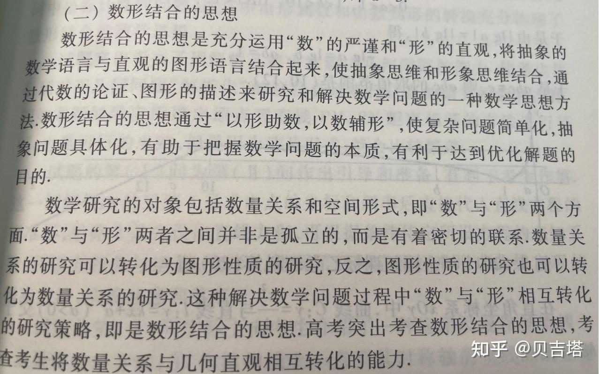
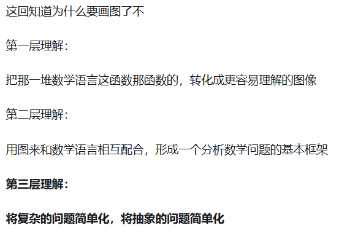

## 数学思想

### 函数与方程

[浅谈函数与方程思想在中学数学中的应用 - 百度文库](https://wenku.baidu.com/view/2ce3b2e82d60ddccda38376baf1ffc4fff47e22f?_wkts_=1750904425580)

**函数与导数**：函数是[高中数学](https://zhida.zhihu.com/search?content_id=568768342&content_type=Answer&match_order=1&q=高中数学&zhida_source=entity)内容的主干知识，是高考考察的重点。高考中主要考察函数的概念与表示，函数的[奇偶性](https://zhida.zhihu.com/search?content_id=568768342&content_type=Answer&match_order=1&q=奇偶性&zhida_source=entity)、单调性、极大（小）值、最大（小）值和周期性；考察[幂函数](https://zhida.zhihu.com/search?content_id=568768342&content_type=Answer&match_order=1&q=幂函数&zhida_source=entity)、指数函数、对数函数的图像和性质以及函数的应用；考察导数的概念、导数的几何意义、导数的运算以及导数的应用，重点考察利用导数的方法研究函数的单调性、极大（小）值、最大（小）值，研究方程和[不等式](https://zhida.zhihu.com/search?content_id=568768342&content_type=Answer&match_order=1&q=不等式&zhida_source=entity)。

对函数和导数的考察侧重于理解和应用，试题有一定的综合性，并与**[数学思想](https://zhida.zhihu.com/search?content_id=568768342&content_type=Answer&match_order=1&q=数学思想&zhida_source=entity)方法**紧密结合，对函数与[方程思想](https://zhida.zhihu.com/search?content_id=568768342&content_type=Answer&match_order=1&q=方程思想&zhida_source=entity)、数形结合思想、分类讨论思想都进行深入的考察，体现能力立意的命题原则。

下面是**函数与方程思想**：

[函数思想](https://zhida.zhihu.com/search?content_id=568768342&content_type=Answer&match_order=1&q=函数思想&zhida_source=entity)就是利用运动变化的观点分析具体问题中变量的关系，并通过函数的形式表示出来，加以研究，从而使问题获解。方程思想是从问题的数量关系入手，运用数学语言将问题中的条件转化为方程，然后通过研究方程使问题获解。函数与方程的思想，既是函数思想与方程思想的体系，也是两种思想综合运用的体现，是研究[变量与函数](https://zhida.zhihu.com/search?content_id=568768342&content_type=Answer&match_order=1&q=变量与函数&zhida_source=entity)、想等与不等过程中的基本数学思想。

### 数形结合

| 数学思想   | 关键词           | 高中内容举例                 | 考纲关键词                 |
| ---------- | ---------------- | ---------------------------- | -------------------------- |
| 函数与方程 | 变量、映射、建模 | 函数、数列、导数             | 运用、理解内在联系         |
| 数形结合   | 图像、辅助、直观 | 解析几何、向量、不等式       | 数形互译                   |
| 分类讨论   | 分类、枚举、综合 | 参数问题、绝对值、分段函数   | 合理分类、综合结论         |
| 转化与化归 | 化简、转换、迁移 | 立体几何、三角恒等式、构造法 | 转化、简化                 |
| 归纳与演绎 | 猜想、证明、逻辑 | 数学归纳法、函数性质         | 发现规律、逻辑推理         |
| 特殊与一般 | 推广、验证、抽象 | 数列、函数、几何定理         | 从特殊到一般、从一般到特殊 |

## 如何制作错题本

理解上有偏差很正常

**而你的错题本**

**就是用来记录这个偏差的！**

具体这个偏差怎么记录呢?

很简单，只有一个要求

就是当你想到这个记录偏差的这句话时

你做这一系列题都不会在产生错误

当然，这句话是要不断迭代的

随着你掌握的题目数量增多

这句话会变得越来越凝练

只要执行的到位

最后的境界是

错题本上的十几句话便可概括出

你在某个学科中所有无法得分的原因

从此之后

什么发挥失常都不再存在于你的词典中

你的一切付出都记录在了这几句话中

面对高考也会是一种极其坦然的态度应对

因为你知道

你准备的

就是高考要考的

## 如何刷题

实操

成体系的刷题法提分才最爽，这是我上武大的秘籍，现在分享给你了，能不能领悟到全靠你自己。

我把它称为**循环暴力提分刷题法**：

第一步，肾上腺素：

以30分钟为最短训练时间，把日常刷题当成考试，30分钟内，尽自己全力去在这组题目中得最高分。发现一些题目过难时可以跳过，但是至少要思考10秒，要求在这30分钟内对所有题目都有大概的印象。

30分钟结束后，会有对的题目、错误的题目、不会的题目。对的题目先不管，错的与不会的全部进入第二步。

第二步，攻坚狂顶：

以每道小题10分钟，大题15分钟为上限，不看答案，自己独立思考再做一遍错的与不会的题目。这一步，结果写不写出来都不重要，重要的是调动一切思维，忍受巨大的阻力，去尽全力解这一道题目。不用焦虑没做出来的情况，只要你借助题目有了思考，就会有能力上的进步。

第三步，吸收感悟：

把第二步攻坚题目的解法与标答对比，从标答中查漏补缺，看完后要求自己再独立做一遍。之后，关键的来了，去反思这道题目，将卡壳的做得慢的不会的原因写出来，要求简短最多不超过两句话，并且，只要想到这句话，就一定能把题目做出来。日后，每次开始走刷题

第四步，至臻提取：

提取出这三步中对你最有启发性的题目，之后的早读、自习课之类的时间不定期翻阅，时间充裕的时候对他们再集中走一次循环刷题法。

第五步,回到第一步开始新的循环。

作者：怪兽
链接：https://www.zhihu.com/question/35049882/answer/2962761030
来源：知乎
著作权归作者所有。商业转载请联系作者获得授权，非商业转载请注明出处。